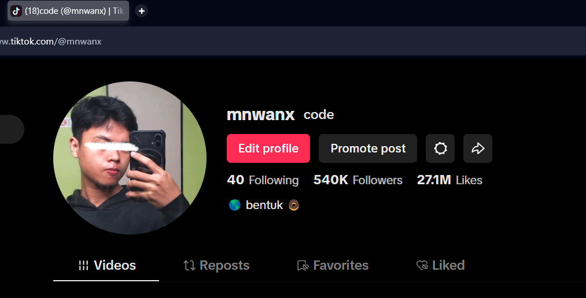
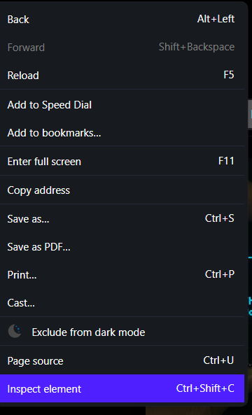
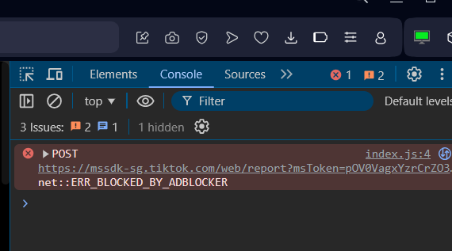
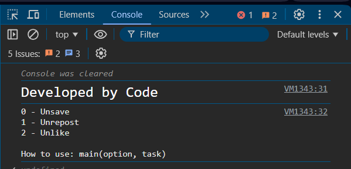

# TikTok Undo

## 🚀 Overview
- This code is to automate unsave, unrepost, unlike on your tiktok

## Developer
- Code

## Date
- 24 / 02 / 2025

## Version
- v2025.0.0-Dev

## 🎯 Features
- ✅ UnRepost
- ✅ UnSave
- ✅ UnLike

## 🛠️ Tech Stack
- **Languages:** JavaScript

## ⚙️ How To Use?

1. Go to main.js

2. Copy the entire code

3. Got to tiktok.com > your account > like / repost / save > choose 1 video to start

4. Right click on your mouse
5. Choose ```Inspect Element```

6. Go to console

7. Paste the code **WITHOUT** any changes.

8. Type ```main(option, task)```

9. Press enter
10. Type ```help()``` to view help again. 

## 📬 Contact  
- **GitHub:** [@mnwanx](https://github.com/mnwanx)  
- **Instagram:** [@mnwanx](https://instagram.com/mnwanx)  
- **TikTok:** [@mnwanx](https://www.tiktok.com/@mnwanx)  
- **LinkedIn:** [mnwanx](https://www.linkedin.com/in/mnwanx)  
- **Website:** [mnwanx.github.io](https://mnwanx.github.io)  

